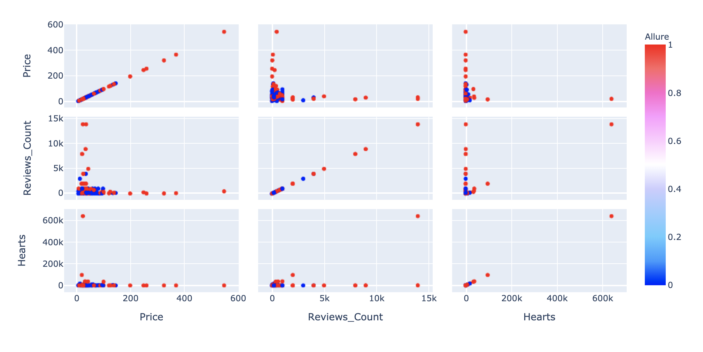
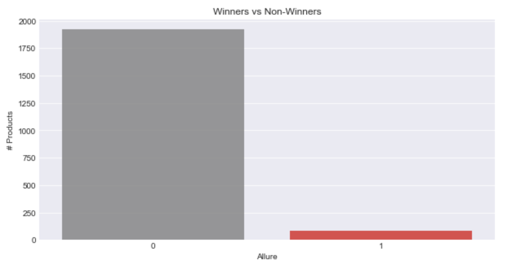
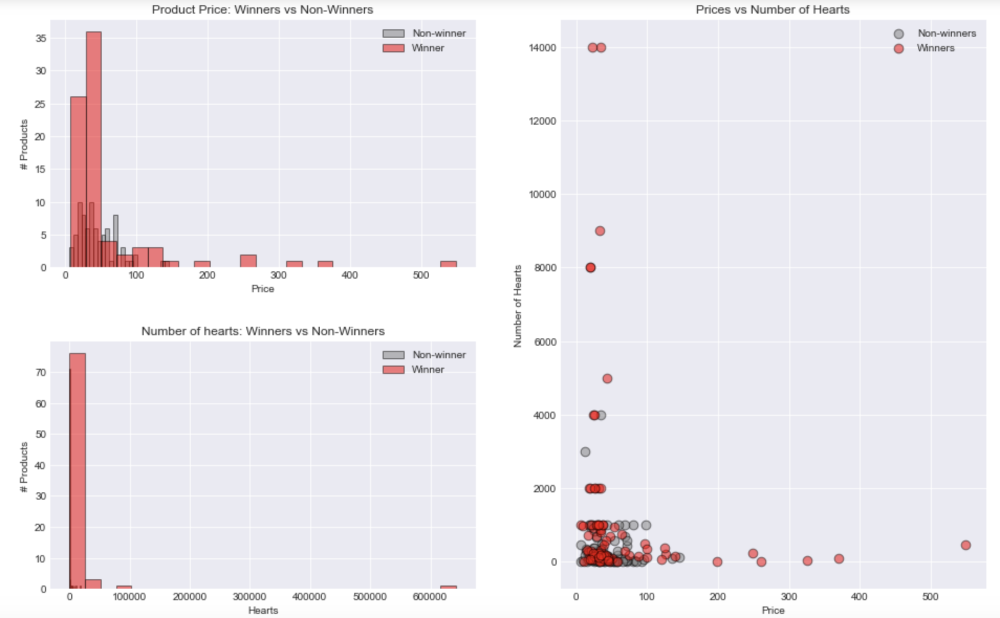
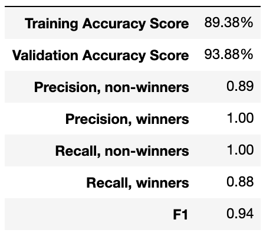

# Sephora_Classification

--------------------------

Navigation:
Jupyter_Notebooks - has four separate notebooks with code for different stages of the project: gathering the data, cleaning, EDA, and modeling. 
Data - has multiple csv files with unclean data (the way my scraping function works resulted in multiple files), and one cleaned dataset 'True_Final_Sephora.csv' that was used for EDA and modeling. Slides in PDF format are also available.

--------------------------

The goal of this project was to build a classification model. I decided to use the data from the famous beauty giant, Sephora, and try to predict weather or not a product is going to win an Allure beauty award. The red seal of Allure approval is given to several dozens of beauty products annually and usually is associated with high quality and effectiveness. As the Allure magazine writes, '...we distribute thousands of the world’s most ahhhmazing beauty products, in dozens of categories, to five-person testing teams. Carefully log their feedback over several months. Create 10-person shade-swatching panels to try umpteen lipsticks and shadows (and also a lot of makeup remover). Call (and email and sometimes text — sorry, Ni’Kita Wilson) cosmetic chemists and dermatologists and manicurists and makeup artists and hairstylists to find out what they love most of all, what they think about that new clinical study, and what they open their own wallets for.'

All in all, the probability of winning the award is seemingly unpredictable, because it is hard to tell, will the experts love the product or not by just having the information about the product, but not the experts. However, it was worth trying. 

# EDA and Class Imbalance

I scraped the Sephora website (this time I ignored the products that are not sold at Sephora) with Selenium and created a dataframe with following column names: Brand, Product, Price, Number of Reviews, Number of 'Hearts', Clean Beauty (1/0), Allure award (1/0). Every variable had interesting distribution, but after aggregating by winners and non-winners I have noticed that the winning products have significantly different means and standard deviations in each numerical category. 

# Modeling

I tried several strategies to handle the class imbalance problem (having 2000 observations and only 81 winners), but the one that actually worked and improved the recall of my model was somewhat non-traditional: I created two separate dataframes, winners and losers, shuffled the rows of the losers dataframe, cropped it to match the dimension of the winning dataframe (81, 7), concatenated them and shuffled again. Surprisingly, using the built-in method for random undersampling didn't result in improvement of the recall or accuracy score. 

My final model, that performed the best, was XGBoost with manual random undersampling. I was able to spot the winner with 93.88% accuracy and 0.88 of recall. 

